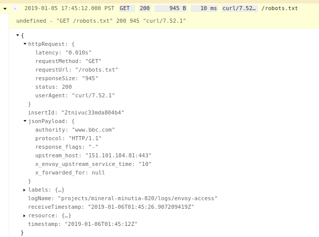
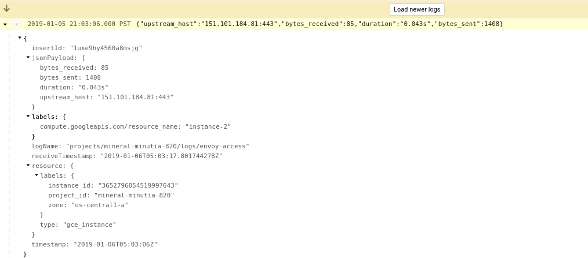

# Envoy http/tcp Parser Plugin for [Fluentd](https://github.com/fluent/fluentd)


## Overview

[fluentd](https://www.fluentd.org/download) and [google-fluentd](https://github.com/GoogleCloudPlatform/google-fluentd)  parser plugin for [Envoy Proxy](https://www.envoyproxy.io/docs/envoy/latest/configuration/access_log)  Access Logs.

This is a simple plugin that just parses the default envoy access logs for both

- `envoy.http_connection_manager` ->  `envoy.file_access_log`
- `envoy.tcp_proxy` -> `envoy.file_access_log`

For each format, this plugin also parses for two targets:

- "normal" `fluentd` which prints logs 'as-is'
- `google-fluentd` where the http_connection_manager access logs gets converted to [httpRequest](https://github.com/googleapis/googleapis/blob/master/google/logging/type/http_request.proto) protocol format.

> TODO:  support arbitrary regex format (not just the default envoy http and tcp logs)
> TODO:  support other [envoy filters](https://www.envoyproxy.io/docs/envoy/latest/configuration/network_filters/network_filters) logs as available

References:

- [Envoy, Nginx, Apache HTTP Structured Logging with Google Cloud Logging](https://github.com/salrashid123/gcp_envoy_nginx_apache_structured_logs)

## Build

Available on ruby gem

- [https://rubygems.org/gems/fluent-plugin-envoy-parser](https://rubygems.org/gems/fluent-plugin-envoy-parser)

If you wnat to build from scratch:

```
gem build fluent-plugin-envoy-parser.gemspec
```

This will give you the `fluent-plugin-envoy-parser-A.B.C.gem` file to deploy


## Start Envoy

First lets setup `envoy` on a target sytem

- You can either run envoy in docker or extract the binary:

In the same folder as this repo, run:

```
   docker run -v `pwd`example/:/apps -p 10000:10000 envoyproxy/envoy -l info -v /var/log/envoy.log:/var/log/envoy.log -c /apps/envoy_config_http.yaml
```

At this point, you'll have envoy running on port `10000`.  The sample envoy config does nothing other an return the `/robots.txt` file from a particualr site.


If you would rather run envoy directly w/o docker on a target system, you can extract the binary from the dokcer image to your local system (eg. via a volume map). You can find the envoy binary inside the container at `/usr/local/bin/envoy`.  For example, on linux:

```
docker run  envoyproxy/envoy

then
$ docker ps
CONTAINER ID        IMAGE               COMMAND                  CREATED             STATUS              PORTS               NAMES
5642eabfb477        envoyproxy/envoy    "/docker-entrypoint.…"   26 seconds ago      Up 25 seconds       10000/tcp           epic_shtern

$ docker cp 5642eabfb477:/usr/local/bin/envoy .
```


## Install

Or on any environment, you can install remotely via 

`gem install fluent-plugin-envoy-parser`

## Target Installations

If you want to use this pluign-in on out of the box `fluentd`

### td-agent

First install `fluentd`  (the command below is for `xenial`)
```
curl -L https://toolbelt.treasuredata.com/sh/install-ubuntu-xenial-td-agent3.sh | sh
```

- install this local (or remote) gem file:

```
sudo /usr/sbin/td-agent-gem install fluent-plugin-envoy-parser

or

sudo /usr/sbin/td-agent-gem install --local fluent-plugin-envoy-parser-0.0.6.gem
```

-  copy a sample config provided in this repo and restart

```
cp fluentd_envoy_td.conf /etc/td-agent/td-agent.conf

service td-agent restart
```

- tail the log file

```
tail -f /var/log/td-agent/td-agent.log
```

#### HTTP

If you want to use this agent to track `envoy.http_connection_manager`, then edit `/etc/td-agent/td-agent.conf` and set the `log_format` value as `envoy_http`:

```
  <parse>
    @type envoy
    log_format envoy_http
  </parse>
```

Then restart the td-agent.

If you then configure envoy to run the `envoy_config_http.yaml`, send some traffic in directly like


```
curl -H "Host: www.bbc.com" http://localhost:10000/robots.txt
```


the on the `td-agent.log` file you should see:

```
2019-01-06 04:59:12.000000000 +0000 envoy-access: {"protocol":"HTTP/1.1","response_flags":"-","x_envoy_upstream_service_time":"11","x_forwarded_for":null,"authority":"www.bbc.com","upstream_host":"151.101.184.81:443","httpRequest":{"requestMethod":"GET","requestUrl":"/robots.txt","responseSize":945,"status":200,"userAgent":"curl/7.52.1","requestSize":0,"latency":"0.011s"}}
```

#### TCP

To use `fluentd` to parse `TCP` traffic, just set `/etc/td-agent/td-agent.conf` `log_format` value as `envoy_tcp`:

and restart fluentd and envoy as well to use `envoy_config_tcp.yaml` for the envoy configuration.

the on the `td-agent.log` file you should see:

```
2019-01-06 05:00:45.000000000 +0000 envoy-access: {"bytes_received":85,"bytes_sent":1408,"duration":"0.056s","upstream_host":"151.101.184.81:443"}
```

> note, the output format only shows raw TCP stats as intended.


### google-fluentd

Google Fluentd extends Fluentd to emit structured logs to GCP from a variety of sources.  To set this up, you can either run the google agent on a GCP VM or on any other platform.  The example provided below is just for a GCE VM:


#### Install

First install the agent on a VM:

```
    curl -sSO "https://dl.google.com/cloudagents/install-logging-agent.sh"
    bash install-logging-agent.sh --structured
```

- install the `.gem`:

```
/opt/google-fluentd/embedded/bin/gem install fluent-plugin-envoy-parser

or

/opt/google-fluentd/embedded/bin/gem install --local fluent-plugin-envoy-parser-0.0.6.gem
```

- Copy the fluentd configuration needed for default http over and restart

```
cp fluentd_envoy_google.conf /etc/google-fluentd/config.d/envoy.conf

service google-fluentd restart
```


#### HTTP

If you started google-fluentd with `log_format` value as `envoy_http` mode and have envoy running in ths same, if you end traffic in:
 
```
curl -H "Host: www.bbc.com" http://localhost:10000/robots.txt
```

You should see **structured** logs in GCP:  

By structured, notice the `httpRequst` prtocol buffer is populated in the logs"

  - 

#### TCP

For generic tcp traffic, reset the `log_format` to `envoy_tcp` 

```
  <parse>
    @type envoy
    log_format envoy_tcp
  </parse>
```

and restart envoy with the config `envoy_config_tcp.yaml`

Once you send any traffic in (i'm using http here)
```
curl -H "Host: www.bbc.com" http://localhost:10000/robots.txt
```

You will see genreic traffic describing the connection:

  - 


## Appendix

### Record-Transformer to httpRequest.proto

The section that converts the log message to a protocol buffer is shown below

```
<filter envoy-access>
  @type record_transformer
  enable_ruby true
  <record>
    httpRequest ${ {"requestMethod" => record['method'], "requestUrl" => record['path'], "responseSize" => record['bytes_sent'], "status" => record['response_code'], "userAgent" => record['user_agent'], "requestSize" => record["bytes_received"], "latency" => record["duration"]  } }
  </record>
  remove_keys method, path, bytes_sent, response_code, user_agent, bytes_received, duration
</filter>
```

### Unit Test

```
$ ruby test/plugin/test_envoy_parser.rb 
Loaded suite test/plugin/test_envoy_parser
Started
..

Finished in 0.002271504 seconds.
-----------------------------------------------------------------------------------------------------------------------------------------------------------------------------------------------
2 tests, 2 assertions, 0 failures, 0 errors, 0 pendings, 0 omissions, 0 notifications
100% passed
-----------------------------------------------------------------------------------------------------------------------------------------------------------------------------------------------
880.47 tests/s, 880.47 assertions/s
```